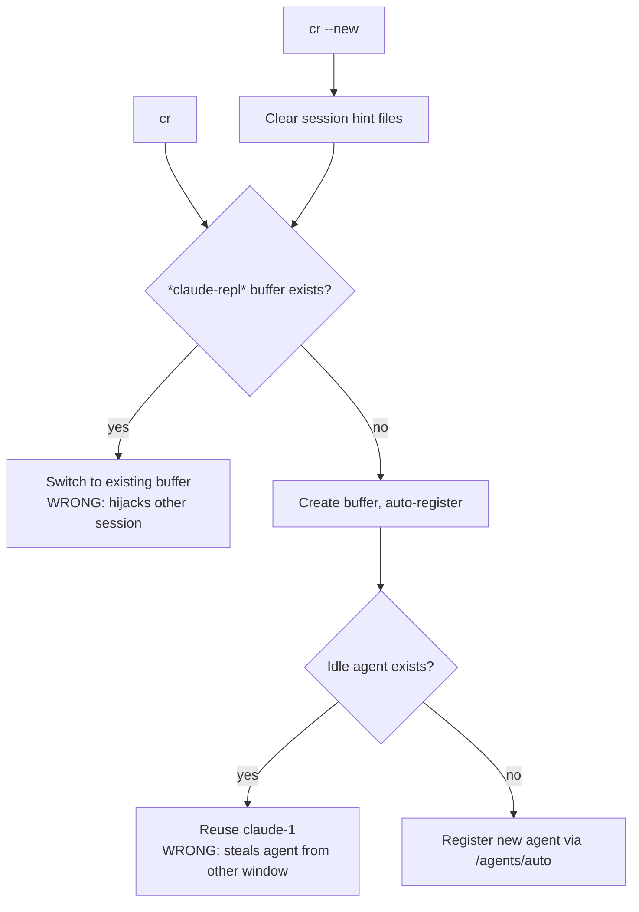
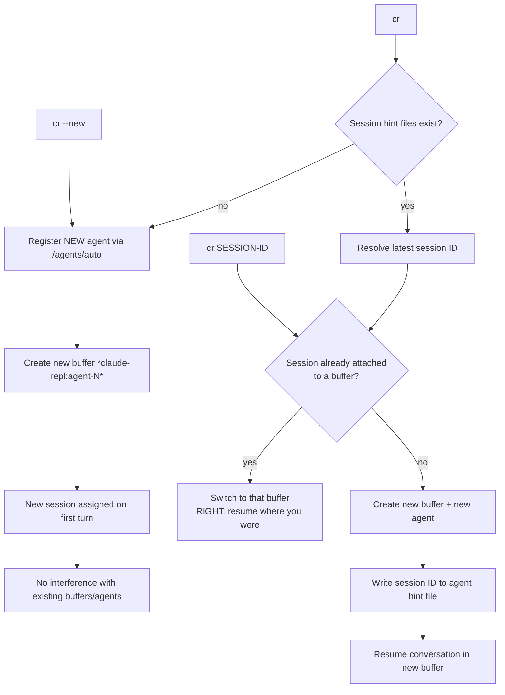

# Excursion: Vasilopita

**Date:** 2026-04-07
**Entry point:** E-sorry-initialization residue → inhabitation-feeds-evolution →
"make it no harder to do what I want than to do what I don't want"

## What This Is

The proof is in the pudding. E-sorry-initialization identified that the
REPL evidence gap is on the critical path for the causal model (Click 2),
and that `surface-earns-inhabitation` explains *why* the gap persists:
the CLI has less entry friction than the REPL, so the CLI wins and the
Baldwin loop starves.

This excursion closes that specific sorry by making the infrastructure
path (claude-repl with evidence logging) exactly as easy to enter as the
primitive path (alacritty + claude CLI).

## The Intervention

`cr` — a two-letter command that starts claude-repl in terminal Emacs.

```
cr                    # resume latest session
cr SESSION-ID         # resume specific session
cr --new              # fresh session
```

Equivalent friction to: `claude --permission-mode bypassPermissions`

Located at: `futon0/scripts/cr`, symlinked to `~/bin/cr`.

### What it does that the CLI doesn't

- Evidence logging (every turn logged via Agency)
- Frame persistence (SQLite)
- Session continuity (session ID preserved across restarts)
- Agent registration (appears in Agency registry)
- Session-start evidence emission (the act of starting is itself logged)

All of this comes free with inhabitation — no extra steps.

### What it does that claude-picker --repl didn't

- Opens in the terminal (`emacsclient -t`) not eval-only (`-e`)
- Auto-starts Emacs daemon if none running
- Two letters to type instead of a path + flag
- Accepts session ID as positional argument

## Edges Walked

- E-sorry-initialization (the sorry that led here)
- inhabitation-feeds-evolution.flexiarg (the pattern that explains it)
- surface-earns-inhabitation.flexiarg (the design principle)
- claude-picker (existing infrastructure, reused for session/evidence logic)
- claude-repl.el, agent-chat.el (the surfaces being made inhabitable)
- M-repl-wins-over-cli (the mission this excursion advances)

## Test

The test is inhabitation. If Joe starts using `cr` instead of
`alacritty + claude`, turns will flow through the evidence pipeline,
and the Baldwin loop reopens. Observable via:

- Evidence entries with `"source": "cr"` tag
- Session-start events in the evidence landscape
- Decrease in CLI-only sessions (no evidence entries)
- Eventually: enough data for Click 2 (recording → creativity)

## Session Routing (current vs desired)

### Current behaviour (broken)



### Desired behaviour



### Guarantees

1. **`cr --new` never reuses** — always new agent, new buffer, new session.
2. **`cr SESSION-ID` checks before acting** — if that session is already
   live in a buffer, switch to it (no duplication). If not, create a new
   buffer and agent for it.
3. **`cr` (bare) is sugar** — resolves latest session, then follows the
   `cr SESSION-ID` path. If no session exists, follows `cr --new` path.
4. **No cross-window leakage** — a buffer owns its agent; `cr` in another
   terminal never steals it.

### What needs to change in claude-repl.el

- `claude-repl--auto-register` currently reuses idle agents. Needs a
  `force-new` parameter that skips `claude-repl--find-idle-agent`.
- `claude-repl` currently reuses the `*claude-repl*` buffer by name.
  Needs a variant that creates uniquely-named buffers (e.g. by agent ID).
- Need a way to query "is session X already attached to a buffer?" so
  `cr SESSION-ID` can switch-to-or-create correctly.

## Residue

- `cr` exists and is on PATH. Shell-side plumbing works (Agency
  discovery, session hint files, evidence emission, debug output).
- **The entry friction is not yet removed.** The shell script can't
  enforce the desired guarantees without changes to `claude-repl.el`:
  (a) force-new agent registration, (b) unique buffer naming,
  (c) session-to-buffer lookup for resume-or-switch.
- This is genuine M-repl-wins-over-cli Phase 2 work — the excursion
  found the sorry but can't close it from the shell side alone.
- If `cr` is not used after these changes, the diagnosis moves from
  "surface friction" to something else (capability gap, habit, daemon
  reliability). That's also useful information.
- Agency reachability: `cr` now checks and warns. Graceful degradation
  (evidence-less mode) is a possible future enhancement.
