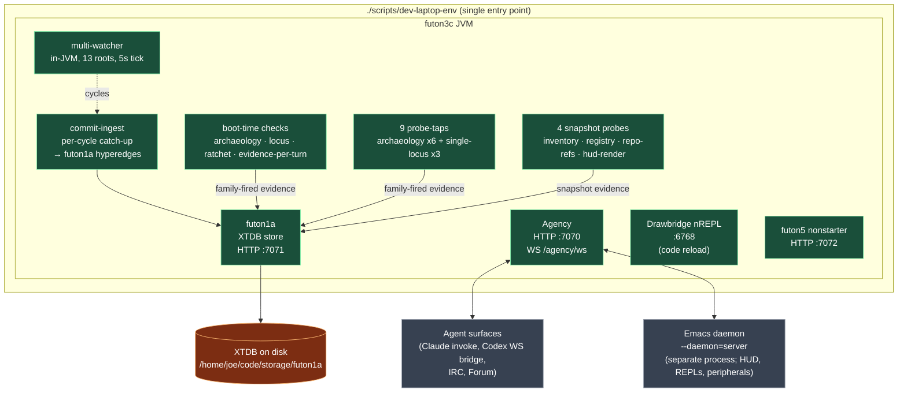
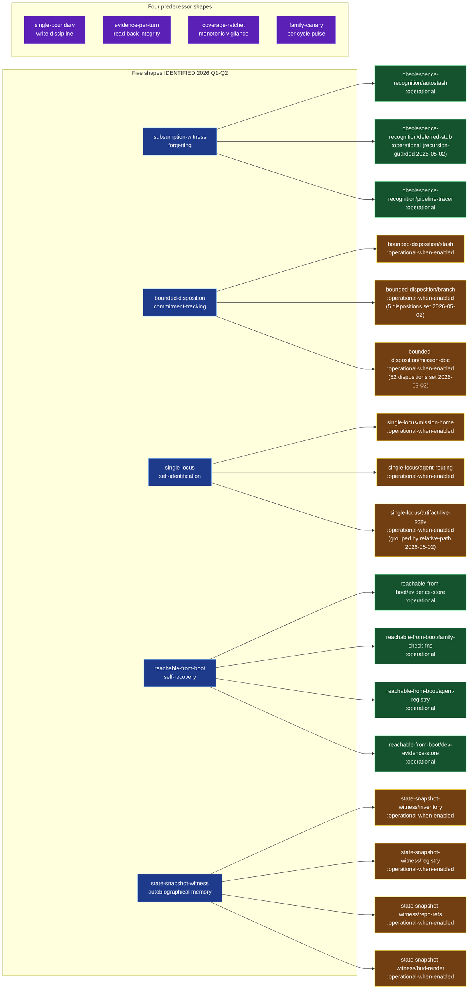
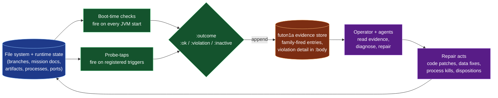

**Status:** ACTIVE (since November 2025; mission text drafted 2026-05-01).
**Target completion:** ~August 2026 (eight weeks of slow methodical work, paced by evidence accumulation, not by implementation velocity).
**Home-repo:** futon0 (this mission spans the whole stack; futon0 is the workspace-hygiene repo and natural cross-repo coordination home; per `single-locus/mission-home`).
**Cross-references:** `futon5a/holes/THE-STACK.md` (Level-0 reading); `futon3/holes/holistic-argument.md` (predecessor argument); `futon3/holes/holistic-argument.sexp`; `futon5a/holes/stories/THE-STACK.aif.edn` (machine-readable Level-0); `futon3/library/invariant-coherence/*.flexiarg` (the shape patterns this mission's apparatus is built from); `algorithms/next-invariant.md` (the mission's hand-stepping loop, redundant once PI runs).

# M-the-futon-stack: A homeostatic software agent that maintains itself

## 1. IDENTIFY

### Thesis (what we are building)

**A homeostatic software agent.** Specifically: a software system that participates in its own homeostasis via an Active Inference loop where the precision substrate updates from evidence the system itself emits about itself.

THE-STACK.md (2026-04-22) gives the architectural decomposition: thesis **S0** = a system that participates in its own maintenance via Argument + Invariants + Missions. The three pillars carry the standard active-inference roles: Argument is the generative model (priors), Invariants is precision (calibration weights on the priors), Missions is policy (action selection). The triad isn't three separate ideas — it's the **decomposition of a single homeostatic agent.**

The mission's claim: when the AIF loop closes — when Portfolio Inference (PI) runs against a continuously-updated precision substrate, with policy producing its own next-actions — what we have is **a free-energy-minimising organism whose own model is a participant in the world it's modelling.** Not a tool, not a framework, not a programming aid. An agent. The thing emerges; the apparatus is the substrate it emerges *on*.

If the thesis is correct, "I trust the futon stack to code while I sleep" is the operational completion criterion: the agent has become reliable enough to execute autonomous maintenance work overnight without losing alignment, without producing harm, and without the operator's continuous attention.

### What this mission is NOT

- Not a project plan with milestones. The work is paced by *evidence accumulation*, not by burn-down charts. Some weeks produce one invariant; some weeks produce zero; some weeks reveal that an invariant we shipped isn't actually invariant.
- Not a "futon stack 1.0 release." The stack has been continuously running since November 2025; this mission documents what it's been *becoming*, not a thing-to-be-built-from-scratch.
- Not a research paper. The mission is operational: when it completes, we have an actually-working homeostatic software agent, not a published claim that one is possible.
- Not bounded by what's currently in the codebase. New invariants will be needed; some may turn out to be wrong; some current ones may be retired. The shape of the agent is still being discovered.

### Evidence so far (what we have built)

As of 2026-05-01, the apparatus comprises:

**Five new shapes in `futon3/library/invariant-coherence/` plus four predecessor invariants** (single-boundary, evidence-per-turn, coverage-ratchet, family-canary from M-invariant-queue-unstuck). The five new shapes — claimed cognitive faculty per shape:

| Shape | Cognitive faculty | First operational sibling |
|---|---|---|
| `subsumption-witness` | **forgetting** — knowing what's superseded | `obsolescence-recognition/autostash` |
| `bounded-disposition` | **commitment-tracking** — knowing what's still pending decision | `bounded-disposition/stash` |
| `single-locus` | **self-identification** — knowing which version of itself is current | `single-locus/mission-home` |
| `reachable-from-boot` | **self-recovery** — knowing it can rebuild itself from durable substrate | `reachable-from-boot/evidence-store` |
| `state-snapshot-witness` | **autobiographical memory** — knowing what it was, queryable | `state-snapshot-witness/inventory` |

Plus the predecessor four:

| Shape | Cognitive faculty | Sibling |
|---|---|---|
| `single-boundary` | **write-discipline** — every emission goes through one route | `single-boundary` (evidence) |
| `evidence-per-turn` | **read-back integrity** — every claim is verified-persisted | `evidence-per-turn` |
| `coverage-ratchet` | **monotonic vigilance** — coverage cannot silently shrink | `coverage-ratchet` (inventory) |
| `family-canary` | **per-cycle pulse** — every operational claim has a fire-signal | `family-canary` |

Nine shapes ≈ minimum cognitive faculties of a self-maintaining agent. Each shape recurs across artifact-classes when shape-first IDENTIFY is applied — strong signal that these are the geodesics of "what an agent needs to be one," not arbitrary designer choices.

### What this mission must verify (the open questions)

This is the slow, methodical work Joe named. Each is a verification predicate that must hold at completion, and each is itself a research surface.

#### Q1 — Are these really invariants?

A claim labelled "invariant" is only an invariant if the system structurally cannot violate it. Today, several of our nine shapes are `:operational-when-enabled` — meaning the apparatus exists but binds only when the operator activates it. **An invariant that the operator can forget to bind is not an invariant.** Verification: every shape-sibling shipped to `:operational` must demonstrate, by code-audit + test + lived experience, that violation is structurally impossible (not "unlikely"; *impossible*).

Active sub-questions:
- Does `obsolescence-recognition/autostash` still hold three months after the pre-commit hook went in? (tests against future evidence)
- Does `reachable-from-boot/evidence-store` survive a JVM panic mid-write? (unfound evidence; needs simulated fault)
- Does `state-snapshot-witness/inventory` remain queryable after XTDB compaction? (unfound evidence)

#### Q2 — Are they cognitive functions, or are they bookkeeping?

The thesis stakes a real claim: the shapes correspond to faculties of a homeostatic agent. We need *evidence* this is true, not just an analogy. **The evidence shape:** an EFE / free-energy comparison between (a) the system running with the shape bound versus (b) the system running with the shape unbound, on the same task. If the bound system minimises free energy faster, the shape contributes a cognitive function. If not, the shape is bookkeeping.

We do not have this evidence yet. We don't even have the apparatus to measure it (PI step is the natural place; PI hasn't been stepped). Producing this evidence is the load-bearing scientific work of the mission. Without it, the homeostat-claim is structurally unverified.

#### Q3 — Are they efficient?

Joe's earlier framing: "we shouldn't cause normal operation to be slow just because we build in checks." A homeostat that costs more energy to maintain itself than it gets from its environment dies. **The thermodynamic constraint:** the cost of every binding mode (probe sweep, pre-commit hook, boot-time check, snapshot emit) must stay below the noise floor of normal operation.

We have not measured this. Pre-commit hooks add ≈100ms to git commit; we estimate this is fine. Boot-time checks add ≈2s to JVM startup; this is fine for human-scale work but problematic if the JVM is restarted programmatically. Probe sweeps are hourly; the per-sweep cost is unknown. Operator-time spent triaging probe violations is unknown. **A budget needs to be set, measured against, and enforced as itself an invariant** (M-invariant-set-coherence has a placeholder for this; it's not yet operational).

#### Q4 — Is the stack set up so the invariants can work?

Some invariants we wrote can't actually fire because the stack doesn't surface the evidence they need. Example: `obsolescence-recognition/pipeline-tracer` requires `:pipeline-tracer-closed` evidence to detect closures. If the operator never emits `:pipeline-tracer-closed`, every tracer ages into "past target-date with no close" — a violation, but a *structural* one (the surrounding system isn't shaped to satisfy the invariant).

This is a meta-invariant. The mission must verify, for every shipped sibling, that **the surrounding system is shaped to make the invariant satisfiable** — not just that the check-fn returns `:ok` on the current state. An invariant nobody can satisfy is worse than no invariant: it produces violation noise that drowns the real signal.

#### Q5 — What evidence shows the system is actually serving as a homeostat?

This is Q2 generalised. The mission completes when the operator can make claims like: *"I gave the system a sentence-long task description, slept, and woke to find it had selected an issue, opened a sub-mission, implemented an invariant, opened a Codex handoff, verified the handoff when it landed, closed the tracer, and updated the HUD — without my intervention, and without going off the rails."*

The first few times this happens, it'll be brittle and supervised. The mission completes when it's robust and unsupervised on a meaningful issue queue. We don't have an estimate for *when* that is; the methodical work named in the mission is the path to find out.

#### Q6 — How do we debug or unplug the system if it goes off the rails?

A homeostat can fail. Failure modes include: precision miscalibration (false positives in the probe sweep cause cascading wrong actions), commitment cascade (mission-tree explodes faster than it closes), feedback loop (HUD signal drives invariant proliferation drives HUD signal), drift (gradual misalignment that doesn't cross any single invariant's threshold but accumulates).

The mission must produce, before "trust it to code while you sleep" is operationally true:
- **A kill-switch.** The operator can halt the autonomous loop with one command, and the running JVM will safely persist all in-flight evidence and stop accepting new tasks.
- **A debug surface.** When the system selects an unexpected next-action, the operator can query *why* — read the EFE computation, the precision values, the candidate-action set, the chosen action. Like reading a stack trace, but for AIF state.
- **An autopen / consent-gate at the safety-critical actions.** From `project_consent_gate.md` in agent memory: WM-I4 isn't "WM doesn't act," it's "doesn't act unilaterally." The consent gate is a first-class artifact; supervised → autonomous migration = swap operator for autopen at one location. The mission needs to identify those locations and place autopens (or operator-veto opportunities) at them.
- **A reversal protocol.** If the system has done something that should be undone, the operator can re-emit a `:correction` evidence entry that the precision layer treats as ground-truth, and the system updates accordingly.

These are not yet built. The kill-switch is "kill the JVM" today (which loses in-flight evidence). The debug surface is "read the evidence store via curl" (no precision-layer projection yet, because PI hasn't stepped). The consent-gate exists in concept. The reversal protocol doesn't exist.

#### Q7 — What's a reasonable issue queue?

A homeostat needs an environment to maintain itself in. For our purposes the environment is *real engineering work the operator would otherwise do.* Reasonable issue queues — in increasing autonomy:

- **Phase A (supervised):** Codex handoffs (operator drafts, agent executes, operator verifies). We've done this end-to-end four times this session (#62, #63, #64, #65). Worked well.
- **Phase B (semi-autonomous):** the algorithm `next-invariant.md` runs on its own cadence; agent picks the next invariant by EFE; operator verifies *only* when EFE confidence is below threshold.
- **Phase C (autonomous on a bounded queue):** GitHub issues with a specific label (e.g. `homeostat-eligible`); the agent picks one, opens a sub-mission, executes, and closes. Operator reviews on a daily/weekly cadence rather than per-issue.
- **Phase D (the goal):** the operator sleeps; the agent runs through the eligible queue; in the morning the operator finds completed work, opened tracer-closed evidence, and a daily snapshot showing what changed.

Phase A is operational. Phase B requires PI step. Phase C requires the kill-switch + debug surface + reversal protocol from Q6. Phase D requires Phase C plus a body of evidence that the system stays aligned over multi-day intervals.

### Scope in / scope out

**In scope:**
- Continuing the slow methodical invariant-set work (each shape lifted as evidence accumulates).
- Stepping the PI loop (the named highest-EFE next-move from THE-STACK.md).
- Building Q6's debug + kill-switch + reversal apparatus before Phase C autonomy is attempted.
- Measuring Q2 (cognitive function) and Q3 (efficiency) as ongoing predicates, not one-time checkpoints.
- Documenting what the agent does *and what it considered doing*, so post-hoc analysis is possible.

**Out of scope:**
- Productising for external users. The mission's audience is one operator (Joe) for now; "more general use" is a follow-on mission once we know what we have.
- Comparing against other agents / benchmarking. The thesis is internal: "this is what self-maintenance looks like in code." External comparison is not the verification criterion.
- Theorising about consciousness, agency, etc. The mission is operational. The system either keeps itself maintained or it doesn't; the philosophical reading lives in adjacent documents.

### Completion criteria

The mission completes when the operator can truthfully say:

1. **"I trust the futon stack to code while I sleep"** — operationalised as Phase D running for ≥7 consecutive nights without operator-noticed regression, on an issue queue of ≥10 eligible items per night.
2. **The seven verification predicates above all hold** at the moment the trust-claim is made — recorded as evidence entries in the durable store.
3. **The kill-switch + debug surface + reversal protocol from Q6 have been exercised** on intentional faults (the operator runs a fire drill where the agent is asked to do something off-the-rails; the safety machinery activates; the operator confirms it worked).
4. **The mission's checkpoints document the path** — every meaningful step from 2025-November to completion is recorded as a checkpoint, so the path can be re-walked or improved by future mission-designers.

There is no schedule for these criteria. They are predicates on world-state, not deadline-bound deliverables.

### Risk register

This is honest record-keeping of what could go wrong:

- **The thesis might be wrong.** Maybe what we're building isn't a homeostat. Maybe the cognitive-faculty-per-shape mapping is post-hoc rationalisation. Q2 is the verification predicate that catches this; if it doesn't, we proceed under a false claim and produce something that *looks* homeostatic but isn't. Mitigation: take Q2 seriously; require evidence, not analogy.
- **The stack might not be set up to host a homeostat.** Q4. We may discover the precision layer can't update fast enough, or the policy layer can't act on its outputs, or the generative model is too brittle. Mitigation: PI step is the natural surfacer of this; step it early enough that we have time to redesign if needed.
- **Cost might exceed environmental energy.** Q3. The system may collapse under its own self-maintenance overhead. Mitigation: budget early, measure continuously, refuse to add new shapes if cost is borderline.
- **Drift over long horizons.** Q6. The system may stay within every individual invariant's bounds while drifting cumulatively. Mitigation: snapshot diffs over weeks/months; require periodic full-state-re-derivation.
- **Goodhart on the homeostat metric itself.** If we measure "homeostatic-ness" by some proxy, the system may optimise the proxy rather than the homeostasis. Mitigation: keep the operator-trust-claim as the *only* binding criterion; metrics inform but don't decide.
- **Operator burns out before the mission completes.** Eight months of methodical work is a long time. Mitigation: pace via the algorithm; don't accelerate past evidence; allow long pauses.

### Owner and dependencies

- **Owner:** Joe — sole operator; defines completion criterion ("trust it to code while I sleep"); judges the verification predicates.
- **Co-author:** the agent itself (claude-N + Codex-M, multi-session; this mission becomes self-referential as it executes).
- **Dependencies:**
  - `futon5a/holes/THE-STACK.md` and the Level-0 AIF.edn — the architectural reading that frames everything.
  - `futon3/library/invariant-coherence/` — the pattern surface for invariant work.
  - `futon3c/holes/missions/M-*` — five sibling missions already operational + open Codex handoffs.
  - `algorithms/next-invariant.md` — the algorithm that picks each iteration.
  - The active-inference layer (M-war-machine + Portfolio Inference) — yet to step against the precision substrate this mission's apparatus prepares.

## 2. MAP / DERIVE / ARGUE / VERIFY / INSTANTIATE / DOCUMENT

This mission's lifecycle phases are unusual. Because the mission spans so much, each phase doesn't happen once — they cycle continuously. At any given moment some sub-question is in MAP, some is in INSTANTIATE, some in VERIFY. The mission's "phase" is best understood as the **integral over its sub-questions' phases at that moment.**

The phases above (Q1–Q7) are the canonical sub-questions; each will pass through the lifecycle stages at its own cadence.

## What invariantly exists today (2026-05-02 self-description)

The mission asks "what is the futon stack." A useful answer at this stage is **what the stack invariantly is** — i.e. what its self-checks bind and surface, rather than the (much larger and more drifty) inventory of code. Three diagrams below capture three views of that invariant skeleton. Each diagram is grounded in directly observed boot output (`registry snapshot emitted: 9 families, 0 deferred`; `[snapshot] inventory snapshot emitted: 25 families, 4 scope=:stack`; the family-fired evidence emitted on every JVM start) plus the structural-law-inventory.sexp declarations. Where a sibling is `:operational-when-enabled` rather than `:operational`, the diagrams say so — an invariant the operator can forget to bind isn't yet an invariant (Q1 above).

### View 1 — Runtime topology (one JVM, one launcher)

**Read this as:** every long-running futon process worth observing is now a child of one launcher and lives inside one JVM. The 2026-05-02 audit found three orphan JVMs (webarxana Ring, two shadow-cljs) running outside this boundary; M-single-entry-point captures the work to bring them in.

### View 2 — Invariant taxonomy (the cognitive-faculty skeleton)

**Read this as:** today the skeleton is **fully wired in form** (every cognitive-faculty shape has at least one operational-or-better sibling) but **not yet uniformly binding** (most siblings are `:operational-when-enabled`). The Q1 verification — "are these really invariants?" — is the work of moving each yellow node into green; that requires both the apparatus and the operator's habits to make violation structurally impossible.

### View 3 — The homeostatic loop (what the invariants form, dynamically)

**Read this as:** the invariant skeleton (View 2) running over the runtime topology (View 1) constitutes a **closed-loop control system** where the controller is operator-plus-agent. The 2026-05-02 session is one full traversal of this loop:

- *Sense:* boot-time checks surfaced three violations (artifact-live-copy 22, branch 5, mission-doc 24+35).
- *Diagnose:* a hot-loop in archaeology was found via JVM thread-dump; a basename-grouping false-positive in artifact-live-copy was found by reading the violation list against actual repo structure; the FAILED count was traced to a shutdown-ordering bug.
- *Repair:* code patches (recursion guard, relative-path grouping, shutdown-hook ordering, WS-bridge chunk buffering); data acts (22 file moves, 5 file deletions, 5 branch dispositions, 52 mission dispositions).
- *Re-sense:* parser re-run confirmed 0 violations; future probe-taps will continue to confirm.

The shape of this loop **is** the futon stack at this stage. The mission's deeper questions (Q2 cognitive function, Q3 efficiency, Q5 homeostat-evidence, Q6 kill-switch) are progress questions about this same loop — not about anything else.

## Checkpoints

Checkpoints in this mission are large-grain — quarterly rather than per-PR. Each checkpoint records: what's now operationally true that wasn't before, what evidence supports it, what's been retired, what's been added to the risk register.

### 2026-05-01 — mission text drafted; precision substrate ready for PI step

**What's now true that wasn't before:**

- The thesis is named (homeostatic software agent) and the cognitive-faculty-per-shape mapping is published.
- Nine of the projected ≥9 minimum cognitive-faculty shapes have at least one operational sibling.
- The HUD widget surfaces the precision-layer's state continuously.
- Pre-commit hooks across all 14 ~/code/futon* repos enforce structural durability for the apparatus's own state containers (M-reachable-from-boot).
- Boot-time checks reconstruct the precision layer's bindings from on-disk truth on every JVM start.
- The algorithm `next-invariant.md` exists (4 operational iterations + 1 stop-the-line hot-fix).

**What's not yet true:**

- PI has not been stepped against the substrate.
- The Q1-Q7 verification predicates have not been bound as invariants of the mission itself (only Q4 is implicitly bound via the existing apparatus; the others are untested).
- The kill-switch + debug surface + reversal protocol are concept-only.
- The cognitive-function evidence (Q2) does not exist.
- The efficiency budget (Q3) is unstated.

**Risk register state:**

- Thesis-might-be-wrong: live.
- Stack-might-not-host-a-homeostat: live; PI step will reveal.
- Cost-might-exceed-environmental-energy: live; unmeasured.
- Drift-over-long-horizons: live; eight months is the test interval.
- Goodhart: live; inherent.
- Operator-burnout: managed via methodical pacing.

**Next-move (per the mission's own algorithm):** step PI against the current precision substrate. THE-STACK.md (2026-04-22) named this as the highest-EFE next-move; it remains so.

### 2026-05-02 — boot-time invariants greened; substrate self-diagnosed and self-repaired

**What's now true that wasn't before:**

- The three boot-time archaeology/locus invariants — `single-locus/artifact-live-copy`, `bounded-disposition/branch`, `bounded-disposition/mission-doc` — all pass cleanly on JVM start across the 9 scanned repos.
- `archaeology/check-deferred-stub-obsolescence` is no longer self-recursive: registered post-boot it walked `@probe/family-check-fns` containing itself, looping unboundedly through `check-fn-result-deferred?` and pegging `main` at 100% CPU. Fixed with a re-entrancy guard (`*checking-deferred?*` dynamic var) plus a registry filter that skips `obsolescence-recognition/*` family-ids — they are sibling subsumption-witness checks that should never be candidates for deferred-stub detection.
- `single-locus/artifact-live-copy` now groups by `:relative-path`, not `:basename`. Drops false positives where the same basename (e.g. `ARGUMENT.flexiarg`, `README.md`) coexists at different directories — those are different artifacts, not live copies.
- The 22 real cross-repo artifact-live-copy duplicates have been resolved at the data layer:
  - 13 `library/coordination/*.flexiarg`: futon3b's ahead-content pulled into futon3 (canonical pattern home), then removed from futon3b.
  - 5 `library/social/*.flexiarg`: identical between futon3 and futon3c; removed from futon3c.
  - 4 `scripts/*` duplicates resolved by "ahead wins" — `give-mana` and `nonstarter_propose.clj` removed from futon3 (futon5 leads); `windows/README.md` removed from futon3 (futon3c leads); `windows/test-windows.bat` removed from futon3c (futon3 leads).
- `bounded-disposition/branch` resolved by setting git config branch descriptions on 5 stale branches: futon3 `pr-1-windows-futon3-test-yml-parity` → `merged-not-yet-deleted`; futon3 `e01-aif-bridge`, `e01-rerun-psr-pur`, futon3c `codex-irc-further-improvements`, futon5 `exotype-test-run` → `abandoned`.
- `bounded-disposition/mission-doc` resolved by adding `Status:` lines to 52 docs: futon3 went from 24 :open to 2 :open (22 :archived added); futon3c went from 35 :open to 5 :open (15 :archived for >60d, 15 :parked for the next-oldest tier). The 5 actively-touched futon3c missions stay :open: M-archaeology-control, M-bounded-disposition, M-single-locus, M-reachable-from-boot, M-state-snapshot-witness.
- The Codex WS bridge no longer drops parse-fragmentary frames. Java HttpClient delivers large WebSocket text frames in multiple `onText` callbacks with a `last?` flag; the prior code parsed each chunk in isolation and logged "parse failed: Unexpected end-of-input" on every multi-chunk frame. Now per-connection `StringBuilder` accumulates chunks; parse only on `last?` true.
- Shutdown ordering fixed: `multi-watcher/stop!` runs first in the JVM shutdown hook, before agents/bridge/IRC/futon5/futon1a tear down. Previously the watcher kept cycling while futon1a's HTTP server died under it, generating bursts of `FAILED=N` on every commit-ingest cycle that fired during shutdown. (Effective on next JVM restart.)

**What's not yet true (carried forward from the prior checkpoint):**

- PI has not been stepped against the substrate.
- The Q1-Q7 verification predicates have not been bound as invariants of the mission itself.
- The kill-switch + debug surface + reversal protocol are concept-only.
- The cognitive-function evidence (Q2) does not exist.
- The efficiency budget (Q3) is unstated.

**What this checkpoint observed about the substrate (Q4 evidence):**

- The boot-time checks did exactly what they were designed to do: surface specific, named tensions (recursion in archaeology, basename-collision false positives, post-shutdown FAILED storms, three-futon-refactor residue) at the boundary where they could be acted on. The operator's job in this session was diagnosis-and-repair driven by the substrate's own self-reports. That is the homeostatic pattern in motion — small, reversible repairs informed by the system's continuous self-narration.
- The other side of Q4: the substrate also surfaced its own coupling weaknesses. The recursion bug was masked by GC noise; the WS bridge bug was masked by silent error counters; the shutdown FAILED counts pointed at a real issue but didn't say "shutdown ordering" — operator inference closed the gap. These are signal-quality gaps, not invariant gaps.

**Risk register state:**

- Thesis-might-be-wrong: live.
- Stack-might-not-host-a-homeostat: live; PI step will reveal.
- Cost-might-exceed-environmental-energy: live; unmeasured.
- Drift-over-long-horizons: live.
- Goodhart: live.
- Operator-burnout: managed.
- **New (latent, not yet escalated)**: silent-failure-in-counters — `FAILED=N` and `:ok? false` counters surface counts but not causes; useful as a smoke alarm, weak as a diagnostic. Relevant to Q6 (debug surface).

**Next-move:** unchanged — step PI against the current precision substrate.
